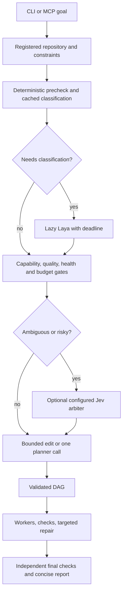
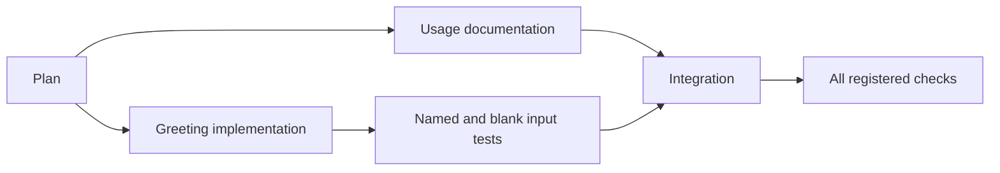

# Architecture

FastAPI handles HTTP. FastMCP exposes orchestration over stdio. Both use the same Engine and SQLite state. Each long-lived service owns a pooled HTTP client, concurrency semaphores and a lazy Laya MCP process. A separate CLI invocation is short-lived. The model registry is data, not a list of model-name conditionals.

`ContextGraph` indexes Python with the stdlib AST and other supported code with conservative text extraction. File hashes and timestamps support incremental reuse. Its index is deliberately smaller than Graphify; Graphify also generates the repository's persistent external architecture map. Source relationships inferred from filenames are labeled inferred. Unknown links are not evidence.

Plans contain architecture, constraints, success criteria, dependencies, artifact paths, capabilities, per-task limits and named validation commands. Workers receive relevant files, exact original hashes, their task, protected constraints and compact dependency summaries. They return `WorkerResult` JSON. They cannot invent shell commands or edit outside declared artifacts.

The scheduler batches dependency-ready tasks only when file read/write sets do not conflict. Tasks running project tests serialize against other writers. One OS lock owns each repository. There are no worktrees or automatic Git commits. Model calls can overlap for independent tasks; writes use content preconditions. On failure or cancellation, only router-written content that still matches the journal is restored. User changes discovered during rollback remain untouched and are reported.

Gateway requests use native pass-through, not the file-edit DAG. This avoids altering host-client tool execution semantics. A compatible provider is required for each endpoint. MCP delegates implementation without replacing Codex or Claude's underlying model transport.

Process-local concurrency/rate controls do not coordinate across separate client MCP processes. Monetary reservations do coordinate through SQLite transactions. This distinction matters if many clients run simultaneously. Graph indexing currently runs synchronously; large repositories can stall other requests during the scan.
