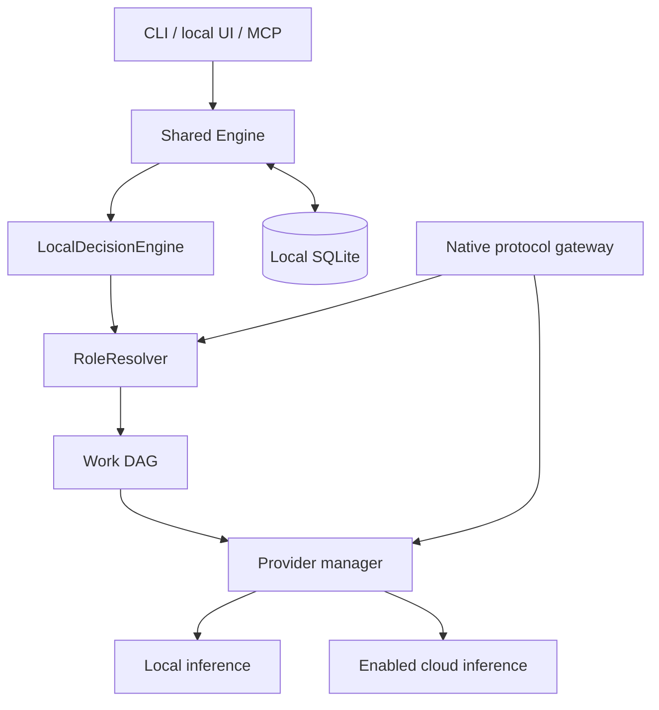
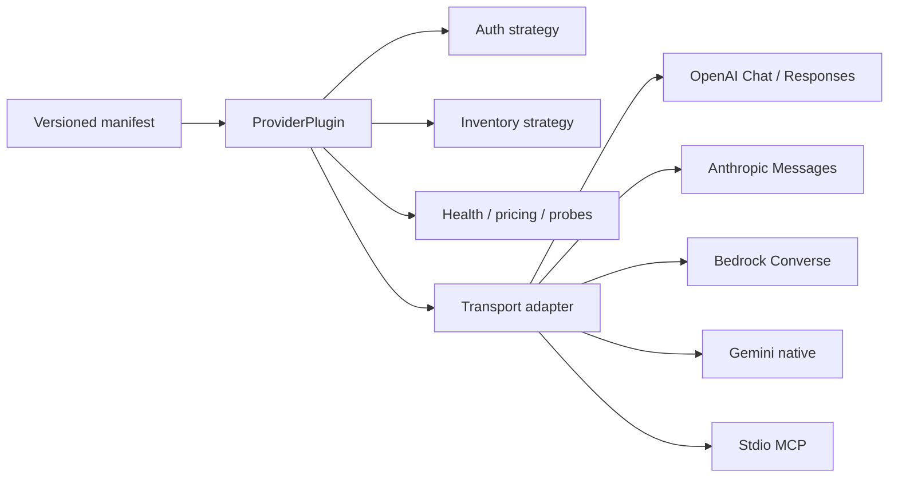
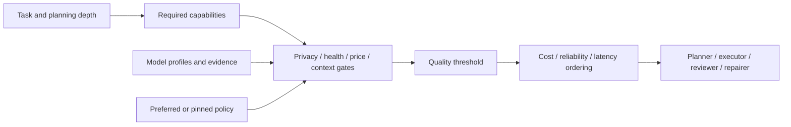
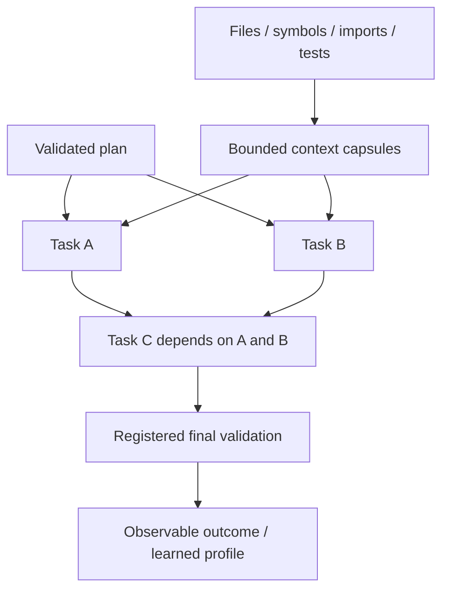
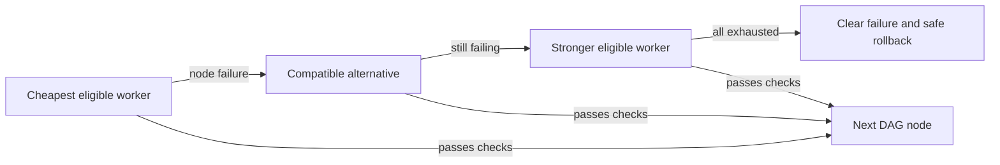
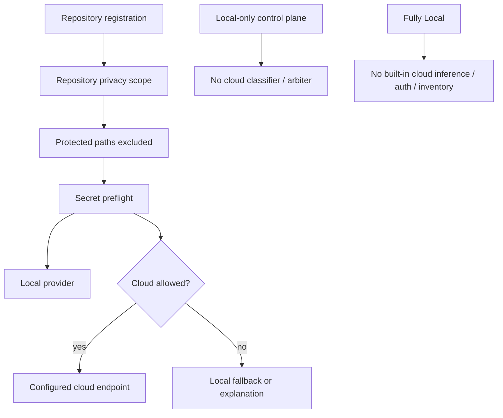

# Architecture

Accension compiles explicit repository goals into AXIR task graphs, binds nodes to capability-qualified models, executes guarded edits and attaches evidence to receipts. Gateway, routing and orchestration are infrastructure beneath the compiler. Ordinary gateway forwarding does not compile a graph.

## Local control plane

`decision.py` uses request signals, repository surface and history without inference. Classifier and arbiter models are optional and cannot use cloud under local-only control policy. Route simulation is deterministic even when a classifier is configured. Zero-model management stays usable.

Declarative intent lives in `config.py`; dynamic registry, evidence, health, usage and execution state live in `store.py`. UI and CLI use `management.py`, with typed validation, stale-file guards, backups and atomic saves.

## Provider plugins

The manager applies privacy, endpoint validation, budgets and typed failures. Built-ins compose shared adapters. Third-party entry points load only when explicitly enabled; they are trusted Python code.

## Role and capability graph

`roles.py` explains both selection and rejection. Pins never bypass safety/availability gates; unavailable pins fall back explicitly. Tiers remain compatibility hints, not the main model abstraction.

## Work DAG and repository graph

The repository graph selects relevant context; the DAG enforces dependencies and write scopes. Nonconflicting ready nodes can run concurrently. Acceptance criteria, constraints and complete edit targets stay intact. Optional context and dependency summaries are reduced before larger-context fallback. One-model execution skips redundant independent review.

## Fallback graph

Fallback edges derive from eligibility and policy. Only the affected node escalates, within its own spend/attempt bounds. Authentication, rate limits, invalid requests, network failures and capability mismatches are distinct errors. Health cooldowns prevent immediate repeated failures.

## Privacy boundaries

Privacy scope reaches all orchestration roles and embeddings. Native gateway requests can attach `metadata.accension_repository` for a registered root. Without this metadata, only global/role restrictions apply; Accension cannot infer a prompt's repository. The routing-only metadata is removed before forwarding.

## State and recovery

SQLite uses WAL, busy timeouts, additive migration and transactional monetary reservations. Ambiguous upstream charges remain reserved. Per-task accounting includes failed worker and reviewer attempts.

File journals and rollback backups are flushed before replacement. Completed DAG batches persist results and fingerprints. Recovery takes the repository lock and checks current hashes, preserving later user edits. Doctor checks database integrity rather than silently replacing a damaged database.

Native forwarding preserves compatible OpenAI/Anthropic tools and SSE. Orchestration adapters are smaller structured-generation interfaces. There is no universal protocol translation, plugin sandbox, semantic cache or automatic model download.

## Compiler and evidence modules

| Module | Responsibility |
|---|---|
| axir.py | Portable envelope, validation, current-pool binding and diffs |
| contracts.py | Context-local privacy/quality contracts and transactional egress |
| dna.py | Typed uncertain evidence and gradual routing influence |
| receipts.py | Durable observations and JSON/Markdown exports |
| savings.py / savings_stream.py | Frozen decimal economics, indexed totals and coalesced SSE |
| lab.py | No-inference preset comparisons |
| task_api.py / mcp_server.py | Native task API, stdio and authenticated HTTP MCP |
| cli_parser.py / cli_commands.py / service.py | Human/JSON CLI and user-level lifecycle |

Savings finalization writes receipt/run/totals in one transaction. Active snapshots remain separate from final totals. Header queries use indexed aggregates, not historical usage scans. Revisions expose another process's settlements to the UI. Missing facts stay unknown. DNA's cost signal only learns from verified receipts and cannot bypass quality gates.

Discovery, health, inference and calibration have configurable concurrency bounds. Registry counts have no fixed product cap. SQL paging supports UI search; role Pareto filtering uses a sorted frontier rather than pairwise comparison. Consumers share eligibility and accounting logic.
