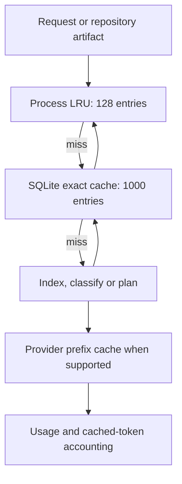

# Cache and token reduction

Accension reuses matching results to avoid repeating work and sending the same context again. It caches classifications, checked plans, file metadata and evaluations. Cache keys include the inputs, relevant file hashes, settings and prompt version. Reused plans receive fresh IDs, and files are checked again before edits. User constraints, acceptance criteria, hashes and tool limits stay intact.



Default TTL is 86,400 seconds. SQLite cache eviction is bounded by entry count; the in-memory front cache uses LRU. Discovery registry ownership lives in a separate metadata table and survives `router cache clear`. Usage reservations/traces are not cache entries.

Context capsules include selected relevant files, direct imports and compact dependency results. Large edit targets are rejected instead of silently truncated. Exact duplicate system messages can be removed; ordinary user/tool history is preserved. No model is asked to summarize away safety or acceptance constraints. Worker source output is not reused blindly.

```powershell
rtk proxy .\scripts\router.cmd cache stats
rtk proxy .\scripts\router.cmd cache clear
```

Hit counters are process-local. Token savings are tokenizer estimates, not billing receipts. Graphify's separate benchmark estimates retrieval size versus reading the whole source corpus; its ratio is not a measured savings claim for every model request.

Semantic caching is not implemented; enabling it raises a validation error. Redis is not used. Plans, cache entries and rollback files can contain private project information even though traces store hashes/metadata by default. Keep `.router` local and ignored by Git. No automatic retention deletion is applied to plans, backups or traces.

Savings Pulse retains graph hit/miss factors and observed plan reuse in receipts. Plan reuse is valued only from original recorded planner usage. Cached provider input remains cloud usage at its cache price. Cache clear preserves receipts, usage, savings and DNA. Context reduction covers the selected capsule subset, including optional-file trimming, not a hypothetical full-repository prompt. [Methodology](docs/SAVINGS.md).
