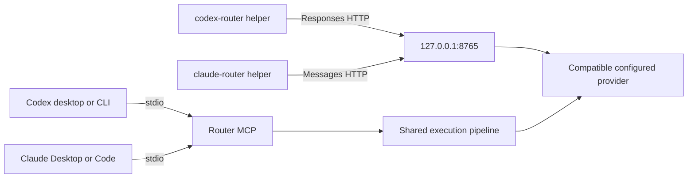

# MCP

Start with `.venv/Scripts/python.exe -m local_ai_router.cli --home <router-root> mcp`. Transport is stdio, using the official MCP Python SDK. No MCP network port is opened. Logs go to stderr. One Engine and its lazy Laya child are reused for the server lifetime.

Six compact tools are exposed: `orchestrate_feature`, `orchestrate_bugfix`, `route_task`, `plan_task`, `execute_plan`, and grouped `router_info` (`status`, `models`, `costs`, `budget`, `cache`, `trace`). The two orchestration tools perform the same bounded execution flow; the bugfix goal supplies the defect context.

Example request after registering a repository and its checks:

```json
{
  "name": "orchestrate_feature",
  "arguments": {
    "task": "Add a greeting function with named and blank input tests",
    "repo_path": "C:/path/to/project",
    "constraints": ["Preserve existing public interfaces"],
    "budget": 0.50,
    "execution_mode": "safe-auto"
  }
}
```

Use `plan-only` to inspect a persisted plan before calling `execute_plan`. A registered root and at least one trusted validation command are required. MCP is a local capability to change those registered repositories; it is not a sandbox and does not grant permission beyond the user's request.



The MCP route delegates work while the host model stays the user's conversational interface. Gateway profiles separately change supported client API transport. They are independent features. The full MCP mock test actually invokes the tool through a stdio client and executes generated tests. Streamable HTTP MCP is not enabled in V1.

Recursion guard: downstream HTTP requests carry `X-Local-Router-Hop`; this gateway rejects reentry. Configuration rejects loopback downstream endpoints pointing at its own port. Host instructions explicitly exclude recursively delegating this router's own development. Operator-configured external MCP workers must not call the orchestrator again.
