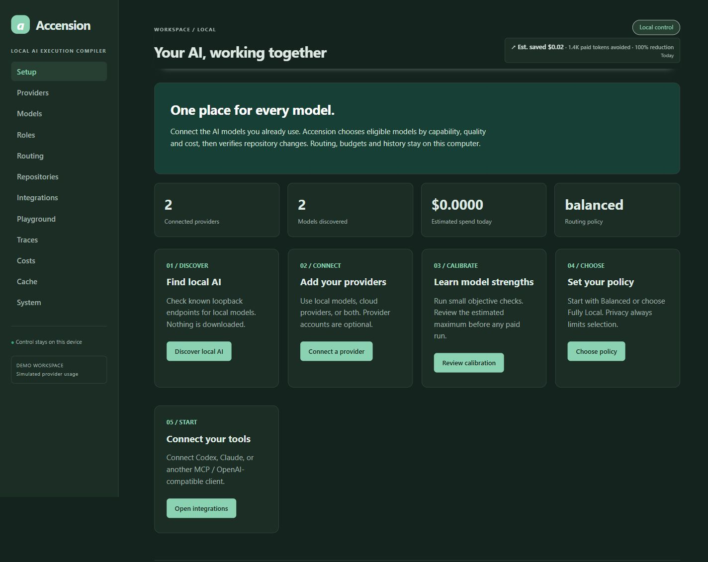

# Accension

[](https://github.com/Jigsaw777/accension/actions/workflows/tests.yml)
[](pyproject.toml)
[](https://github.com/Jigsaw777/accension/actions/workflows/tests.yml)
[](LICENSE)

**Accension helps your AI models work together.** It chooses a model for each task, controls spending, checks code changes and keeps a record of the result.

Accension is open source and runs on your computer. You only pay cloud AI providers if you choose to use them. Local models have no API-token charges, though running them still uses your hardware and electricity.

Use it from a terminal, a local browser app, or a connected assistant such as Codex or Claude. No Accension account or hosted service is required. With no models connected, you can still set up providers, preview routing and run diagnostics.

## Why use it?

Keep local and cloud models in one place. Choose privacy and spending limits. Let Accension route eligible work to models that fit those limits, then inspect its checks and recorded costs. Savings depend on the task and models; extra planning or repair work can cost more.

[Install](#install-and-start-in-the-terminal) · [CLI commands and help](#cli-commands-and-help) · [Modes](#companion-and-sovereign-modes) · [Savings](#savings-pulse) · [Developer install](#developer-install) · [Guides](#guides)

## Install and start in the terminal

Requires Python 3.11+. From a downloaded source checkout on Windows, Linux or macOS, choose one:

```sh
pipx install ".[vault]"
# Or:
uv tool install ".[vault]"
```

These commands install the checked-out version; they do not assume a PyPI release. The vault extra supports Keychain/Secret Service on macOS/Linux; Windows uses DPAPI. Environment credential references work without an OS keyring.

```sh
accs init
accs provider add ollama
accs mode sovereign
accs route "Add a greeting feature with tests" --repo . --explain
accs run "Add a greeting feature with tests" --repo . --local-only
```

Setup registers a repository and trusted validation commands. Install/load your own local model or connect a cloud provider. Execution requires an eligible model; management works with zero models.

For hybrid execution, explicitly permit cloud use for that repository:

```sh
accs provider add openrouter --credential-env OPENROUTER_API_KEY --non-interactive
accs repo add . --privacy CLOUD_REDACTED --check 'tests=["{python}","-m","pytest","-q"]'
accs run "Add a greeting feature with tests" --repo . --budget 0.25 --max-cloud-context 12000
```

## Use the local app

`accs ui` opens the local app at **http://127.0.0.1:8765/ui**. No Accension account is needed. Browser sessions and API clients have separate local security checks. The service only listens on this computer. See [Security](SECURITY.md) for details.

```sh
accs start --background
accs status
accs restart
accs stop
accs serve
```

The background hub needs no administrator rights and installs no autostart. `serve` runs it in the terminal. `ui --no-browser` supports manual opening.

1. **Setup:** discover local models or connect a cloud provider.
2. **Models:** select models, enter missing prices and preview calibration.
3. **Routing:** choose Balanced or Fully Local.
4. **Repositories:** register a root and trusted test/build commands.
5. **Integrations:** preview and install a Codex or Claude connection.

The UI also includes Skills, Presets, Logs, task execution, receipts, model evidence and a Savings Pulse header. Light, dark and system themes are available.



Screenshots use a clearly marked mock workspace. Amounts illustrate configured demo prices and deterministic fixtures, not production savings. [Screenshot gallery](docs/screenshots/README.md).

No YAML or Node.js is needed for this flow. A model remains ineligible until its capability, quality, privacy and price requirements are met.

## Use skills and presets

Already have useful AI skills or instruction files? Accension can find them, group them into reusable presets, and suggest useful combinations for a task. A skill is a reusable guide; a preset is a saved group of skills. Both are optional.

```sh
accs skill scan
accs skill list
accs skill search "debugging"
accs skill info SKILL_ID
accs skill trust SKILL_ID
accs preset create focus --skill SKILL_ID
accs run "Fix this bug" --repo . --preset focus
```

Use the **Skills** and **Presets** pages to manage these without editing YAML. Search works offline. The composer checks declared conflicts, dependencies, order and the active token budget. Local Recipe Memory records which combinations correlate with verified outcomes. It does not claim that skills cause better results. [Skills guide](docs/SKILLS.md).

## Compile, execute and inspect

```sh
accs doctor
accs plan "Refactor authentication" --repo . --export auth.axir.json
accs inspect auth.axir.json
accs reroute auth.axir.json
accs execute auth.axir.json --repo .
accs model dna PROVIDER:MODEL
accs receipt RUN_ID --markdown --output receipt.md
accs lab compare RUN_ID
```

`route` makes no model calls or repository edits. `plan` may invoke an eligible model and saves a reviewable task plan. `execute` applies bounded, hash-checked edits and runs registered validation. `run` combines both. Cloud calibration additionally requires `--allow-paid` after reviewing the quote.

The primary CLI is **`accs`**. Compatibility names **`accension`**, **`router`**, Python **`local_ai_router`**, and MCP **`local-ai-router`** remain supported. See [CLI reference](docs/CLI.md) and [Upgrade notes](docs/UPGRADE_NOTES.md).

## CLI commands and help

Running `accs` without a command opens the UI. Use the commands below for a terminal-only workflow. Replace `PROVIDER:MODEL`, `RUN_ID`, `PLAN_ID`, `SESSION_ID` and `QUOTE_ID` with IDs returned by your local installation. Examples that execute tasks require a registered repository and eligible models; quoted goals are examples for your own project.

| Command families | Purpose |
|---|---|
| `init`, `doctor`, `start`, `status`, `stop` | Configure and operate the local hub |
| `provider`, `model`, `role`, `calibrate` | Connect models and inspect eligibility/evidence |
| `route`, `plan`, `execute`, `run` | Preview or execute repository work |
| `receipt`, `trace`, `savings`, `lab`, `recovery` | Inspect results, accounting and recovery |
| `integrate`, `launch`, `config`, `plugin`, `completion` | Integrate clients and automate management |

### Find help and control output

```sh
accs --help
accs --version
accs init --help
accs provider add --help
accs model dna --help
accs run --help
accs integrate --help
accs savings --help
```

`--help` exits after showing accepted arguments; it does not initialize configuration, call a provider or execute a task. Command-family help also lists available actions. The installed command's help is authoritative for that version. [Captured CLI output examples](docs/EXAMPLES.md) show help, a route, Model DNA and a receipt.

| Common option | Use |
|---|---|
| `--home PATH` | Select a configuration/state home; overrides `ROUTER_HOME` |
| `--json` | Emit machine-readable results on stdout; progress and errors use stderr |
| `--no-color` | Request plain output; output is already uncolored by default |
| `--debug` | Include a redacted traceback for troubleshooting |
| `--mock` | Use deterministic fixture models for development and demos |

Common options work before the command or after its name. For automation, use explicit inputs and `--non-interactive` with `init` or `provider add`:

```sh
accs init --non-interactive --mode sovereign --preset fully-local --repo . --validation python-unittest
accs --json provider list
accs model list --json
accs --home ./accension-config doctor
```

Choose `--validation python-pytest` or `npm-test` when those match the repository. Setup records trusted validation commands; it does not install the project's dependencies. Use a separate home for isolated demos or tests.

### Connect providers and inspect models

```sh
accs provider list
accs provider add ollama
accs provider add openrouter --name team-cloud --credential-env OPENROUTER_API_KEY --non-interactive
accs provider add custom --name local-server --endpoint http://127.0.0.1:8080/v1 --protocol openai --local --non-interactive
accs provider test team-cloud
accs provider refresh team-cloud
```

Set `OPENROUTER_API_KEY` in your environment before connecting that instance. Interactive provider setup can store a hidden key entry in the OS vault; `--credential-env` stores the environment reference. `provider test` defaults to health/metadata checks. Generating a test response requires `--inference`; cloud testing also requires `--allow-paid` and a budget.

Provider add supports named instances, groups (`--group`), model filters (`--include-model`, `--exclude-model`), and native-auth fields such as region, profile and project. See `accs provider add --help` and the [provider guide](PROVIDERS.md).

```sh
accs model list --offset 0 --limit 50
accs model list --provider local-server
accs model search coder
accs model info PROVIDER:MODEL
accs model dna PROVIDER:MODEL
accs model refresh --provider local-server
```

Use the exact model ID from the list, including its provider instance. JSON list output includes `next_offset` when more results exist. Refresh discovers metadata; it does not benchmark the whole catalog. `model enable` and `model disable` change eligibility, while `model dna PROVIDER:MODEL --reset` clears that model's learned evidence.

```sh
accs role list
accs role explain executor
accs role set executor PROVIDER:MODEL
accs role auto executor
accs role reset executor
```

`role set` pins a model; `role auto` returns selection to the resolver; `role reset` restores the role defaults. Pinning never bypasses privacy, capability or budget checks.

### Register a repository and execute work

```sh
accs repo list
accs repo add . --privacy LOCAL_ONLY --check 'tests=["{python}","-m","unittest","discover","-v"]'
accs route "Add a greeting feature with tests" --repo . --local-only --explain
accs run "Add a greeting feature with tests" --repo . --local-only --budget 0.25
```

Validation values are argument arrays, not shell snippets. Register the test/build command appropriate to the project. `LOCAL_ONLY` prevents cloud inference for that repository. `CLOUD_REDACTED` and `CLOUD_ALLOWED` are explicit alternatives; task policy can make repository policy stricter, never weaker.

To review a portable plan before execution:

```sh
accs plan "Refactor authentication" --repo . --export auth.axir.json
accs inspect auth.axir.json
accs reroute auth.axir.json
accs plan diff old.axir.json new.axir.json
accs execute auth.axir.json --repo .
```

Planning may use a model. Inspect/diff/reroute inspect or preview the artifact without applying repository edits. Execution rechecks repository fingerprints, contracts and registered validation. `accs run ... --dry-run` is a route-only preview; `--mode plan-only` compiles without applying the plan.

| Run/plan option | Meaning |
|---|---|
| `--budget 0.25` | Maximum request API budget in USD, also bounded by configured limits |
| `--local-only` or `--privacy LOCAL_ONLY` | Restrict the task to local models |
| `--max-cloud-context 12000` | Bound estimated cloud context tokens for the request |
| `--quality 0.93` | Set the task's minimum quality contract (0–1) |
| `--constraint "Keep the public API"` | Add an explicit constraint; repeat as needed |
| `--session SESSION_ID` | Group calls under a session for budgets and accounting |

Use the execution result's `plan_id` as `RUN_ID` or `PLAN_ID` below to inspect the outcome or recover interrupted work. `recovery list` also shows this value as `id`:

```sh
accs trace RUN_ID
accs receipt RUN_ID
accs receipt RUN_ID --markdown --output receipt.md
accs recovery list
accs recovery inspect PLAN_ID
accs resume RUN_ID
accs rollback RUN_ID
```

Resume requires a valid unfinished checkpoint. Rollback only restores unchanged router-written files; later user edits are preserved. [Receipt guide](docs/EXECUTION_RECEIPTS.md) · [AXIR guide](docs/AXIR.md).

### Inspect costs, savings and model evidence

```sh
accs costs
accs savings --today
accs savings --7d
accs savings --30d
accs savings --all --json
accs savings --session SESSION_ID
accs savings --run RUN_ID
accs savings --run RUN_ID --reprice
accs lab compare RUN_ID
```

`costs` shows the conservative reservation ledger. `savings` reads receipt-based analytics; dollar savings require a configured cloud baseline. Repricing returns separate current-price analysis while keeping historical receipts unchanged. Lab estimates alternative routes from existing evidence, with no paid shadow calls.

```sh
accs calibrate preview --model PROVIDER:MODEL --budget 0.05
accs calibrate run --quote-id QUOTE_ID --allow-paid
accs calibrate --quick --local-only
accs model probe PROVIDER:MODEL --capability text --budget 0.01 --allow-paid
```

Review the calibration quote before running it. `--allow-paid` explicitly permits cloud calls within the stated/configured budgets. Quick local calibration requires eligible local models and makes no cloud calls.

### Integrate clients and maintain configuration

```sh
accs mode
accs mode companion
accs integrate list
accs integrate codex --mode companion
accs integrate codex --mode companion --apply
accs integrate undo codex
accs launch codex --dry-run
accs launch codex --direct
```

Integration commands preview by default. `--apply` installs the reviewed configuration with a backup; undo checks that the managed content has not been changed. Launcher dry-run checks installed client capabilities without opening an agent. `--direct` bypasses the gateway. See [Companion and Sovereign modes](#companion-and-sovereign-modes) for gateway launchers and Claude clients.

```sh
accs config validate
accs config export --file profile.json
accs config import --file profile.json
accs config migrate
accs cache stats
accs cache clear
accs plugin list
accs plugin info openai-compatible
```

Export/import operates on declarative routing profiles, not credentials or executable plugin trust. Cache clearing preserves receipts and savings. To disconnect an instance, use `accs provider remove INSTANCE_ID`; review affected role assignments afterward.

### Shell completion, exit codes and troubleshooting

```sh
accs completion bash
accs completion zsh
accs completion fish
accs completion powershell
```

Completion prints a script for the chosen shell; save/source it using that shell's profile mechanism. It completes command names, not every provider or model ID.

| Exit code | Meaning |
|---|---|
| `0` | Completed |
| `2` | Invalid input/configuration or missing resource |
| `3` | Provider failure |
| `4` | Privacy or budget refusal |
| `5` | Execution/validation or unclassified failure |
| `6` | Service/network/OS failure; `status` reports a stopped hub |
| `130` | User interruption |

Launched clients propagate their own nonzero exit code. With `--json`, runtime errors include `error`, `type` and `exit_code`. Unknown commands and argument syntax errors still print standard argparse usage/error text to stderr and exit with code 2. For diagnostics:

```sh
accs doctor
accs status --json
accs --debug doctor
```

For an unknown model, start with `accs model list` or refresh its provider. For a stopped hub, use `accs start`. For rejected inputs, run the relevant `--help`. For execution failures, inspect the trace and receipt before resuming. Share redacted diagnostics and the installed version when [opening an issue](https://github.com/Jigsaw777/accension/issues).

The [complete CLI reference](docs/CLI.md) also covers compatibility commands such as `models`, `discover`, `integration`, `profiles`, `eval`, `azure-login`, `enroll` and `demo`. See [troubleshooting](TROUBLESHOOTING.md) for provider/authentication and recovery details.

## Advanced: saved plans and execution evidence

- Deterministic local decisions, generic roles, capability/quality/privacy gates and task-level fallback.
- Protocol-based plugins for cloud and local providers, native credentials and conservative discovery.
- Portable **AXIR v1** task intent, capability requirements, dependency/artifact scopes and privacy/egress/quality contracts. Import validates cycles, source fingerprints and currently registered checks; it grants no arbitrary shell execution.
- **Model DNA** with typed dimensions, sample counts, provenance and uncertainty. Unknown dimensions stay unknown; one passing fixture does not certify a model.
- **Execution Receipts** with observed calls, frozen price/usage economics, file/patch hashes, validation, git state, egress and recovery evidence. No full prompts or hidden reasoning; no remote attestation.
- Budgeted calibration, OS-protected secrets, exact cache, durable recovery, and transactional cloud-context/file limits alongside monetary budgets.

## Companion and Sovereign modes

| Mode | Behavior |
|---|---|
| Companion | The MCP host chooses when to delegate. Accension executes the delegated repository task; the host model stays the conversation interface. |
| Sovereign | `accs run` and the task API own repository execution. Supported client launchers separately route inference through the gateway; those clients still own their tools and filesystem operations. |

```text
Companion
Claude / Codex host → MCP → Accension delegated task
                              ↓
                       plan → models → checks → receipt

Sovereign task execution
accs / native task API → local decision → AXIR → work graph
                                               ↓
                                   local / cloud A / cloud B
                                               ↓
                                       checks → receipt

Client gateway launchers
Codex / Claude Code → localhost gateway → eligible model
```

```sh
accs integrate claude-desktop --mode companion
accs integrate codex --mode sovereign
accs launch codex --dry-run
accs launch codex
accs launch claude
accs launch codex --direct
```

Integrations preview by default. Add `--apply` for a backed-up, conflict-checked installation; `accs integrate undo CLIENT` restores only an unchanged managed installation. Sovereign integration writes a local launcher specification, preserving global client transport settings. Installed CLI capabilities are checked. Claude Desktop uses Companion fallback; desktop transport interception is not claimed.

## Savings Pulse

Choose an explicit registered cloud baseline under **Costs → Savings settings**. No expensive model is silently selected. Equivalent logical stages form the baseline; retries and control overhead remain actual costs.

```sh
accs savings --today
accs savings --all --json
accs savings --run RUN_ID
accs savings --run RUN_ID --reprice
```

Baseline costs, saved dollars and cloud tokens avoided are estimates. Actual API cost uses provider-reported usage and frozen configured prices. Unknown usage/prices stay unknown; negative savings stay negative. Local tokens remain separate from cached cloud tokens. Local API cost is zero; hardware and electricity costs are not invented. Repricing returns separate analysis without changing historical receipts.

Incremental SQLite totals keep header queries independent of historical usage size. Coalesced SSE updates include calls made by another local process. Routing Lab compares historical tasks using current eligible models without paid shadow inference. [Methodology and limits](docs/SAVINGS.md).

Your usage and savings ledger stays on your machine. Providers retain their own usage records for calls sent to them.

## Provider and model scale

Provider instance IDs distinguish accounts, regions and endpoints; model identity includes its instance. No fixed provider/model registry count cap is imposed. Discovery and search are paged, concurrency is bounded, and inventory does not eagerly probe every model with paid calls. Memory, API quotas and storage remain practical limits. Provider groups and include/exclude patterns constrain eligibility.

Regression coverage includes 100 provider instances with 5,000 models and header queries over 100,000 runs with two million usage rows.

The [MCP tools](MCP.md) orchestrate repositories. The native gateway forwards compatible OpenAI/Anthropic protocols; it does not translate arbitrary tool or multimodal requests into Bedrock/Gemini.

## Developer install

```sh
python -m venv .venv
# Activate .venv, or use its Python executable below.
python -m pip install -e ".[test]"
python -m pytest -q
```

On Windows the executable is `.venv/Scripts/python.exe`; on Linux/macOS it is `.venv/bin/python`. Optional extras: `azure`, `aws`, `google`, `vault`. No container, external database or frontend build is required.

`router --mock demo --repo /path/to/empty-demo` runs a deterministic greeting fixture with real tests and no paid inference. It never substitutes mock answers for real providers. CI targets Ubuntu, Windows and macOS with Python 3.11–3.13.

Contribution paths include provider plugins, transport adapters, capability probes, benchmark fixtures, UI, documentation, routing policies and client integrations. [Contributor guide](CONTRIBUTING.md).

## Troubleshooting

If something fails, you do not have to guess. Accension keeps local redacted logs and links them to the task trace.

```sh
accs doctor
accs logs
accs logs tail
accs logs show ERROR_ID
```

Logs rotate automatically. They omit prompt bodies, source files, full skill text and provider response bodies. Use **Logs** in the app to filter errors and open a related trace. [Logging guide](docs/LOGGING.md).

## How contributions are protected

Every Pull Request runs automated tests and security checks. Changes to `main` require the repository owner's review, and direct pushes are blocked. Owner-authored PRs use a PR-only review bypass to avoid GitHub's self-review restriction; they must still pass all checks. Passing CI does not automatically merge a contribution.

Start with [Contributing](CONTRIBUTING.md), run `python scripts/check_local.py`, and submit a PR. The [GitHub security guide](docs/GITHUB_SECURITY.md) explains the merge policy and bootstrap setup. CI reduces risk; it cannot guarantee the absence of malicious code.

## Guides

| Topic | Documentation |
|---|---|
| Design and routing | [Architecture](ARCHITECTURE.md), [routing policy](ROUTING_POLICY.md) |
| Connect and configure | [Providers](PROVIDERS.md), [UI](UI.md), [configuration](CONFIGURATION.md) |
| Trust and privacy | [Security](SECURITY.md), [privacy](PRIVACY.md) |
| Extensions | [Provider SDK](docs/PLUGIN_SDK.md) |
| Clients | [Codex](CODEX_SETUP.md), [Claude](CLAUDE_SETUP.md), [MCP](MCP.md) |
| Execution compiler | [CLI](docs/CLI.md), [AXIR](docs/AXIR.md), [Model DNA](docs/MODEL_DNA.md), [receipts](docs/EXECUTION_RECEIPTS.md) |
| Modes and accounting | [Modes](docs/MODES.md), [egress budgets](docs/EGRESS_BUDGETS.md), [Savings Pulse](docs/SAVINGS.md) |
| Operations | [Migration](docs/UPGRADE_NOTES.md), [cache](CACHE.md), [troubleshooting](TROUBLESHOOTING.md), [contributing](CONTRIBUTING.md) |

## Current limits

Calibration is small-fixture evidence, not production-quality certification. Savings are counterfactual estimates, without invoice reconciliation or exact cross-vendor tokenization. Optional analytics cannot fail inference; incomplete accounting is surfaced, although a storage outage can prevent even an error marker from persisting. Repository retrieval is lexical/graph based; embedding transports are optional. Bedrock native probes are limited. Plugins, credential commands, MCP processes and validation are trusted software, not sandboxed. Resume requires a verified unfinished checkpoint; finalized runs need a fresh plan. Live paid client/provider combinations require separate validation in the intended environment.

Licensed under [Apache-2.0](LICENSE). Copyright 2026 Sourik Ganguly and Accension contributors. See [third-party notices](THIRD_PARTY_NOTICES.md).
