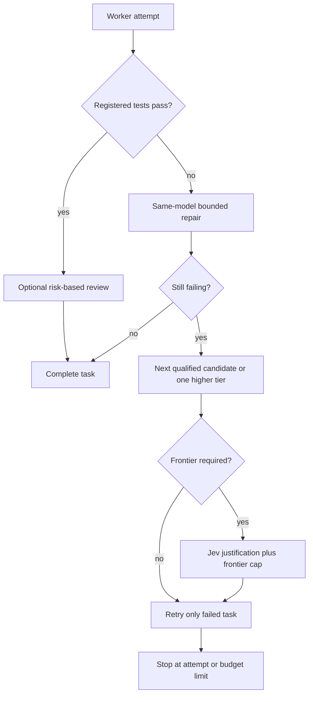

# Routing policy

Policy is in `config/routing.yaml`; budgets in `config/budgets.yaml`. All prices are USD per million tokens. A deployment must be enabled, healthy, permitted for its role and repository, capability-compatible, priced, and above the task-family quality threshold before cost ranking. Unknown price is ineligible, never free.

Simple edits and explanations use a deterministic fast path. Other tasks can use lazy local Laya, with a two-second request deadline and deterministic fallback. Its process survives requests in the gateway and MCP server; its first prediction may finish after that deadline. Cache keys include policy. A high-confidence classification cannot downgrade deterministic critical risk. Laya estimates are routing inputs, not verified facts.

Jev is an optional configured model alias (`jev_model`), not an invented provider/model name. Low confidence, high risk, architectural work or repeated failures trigger arbitration when available. Critical work currently requires it. Jev can select only eligible candidates. It cannot override monetary reservations or authorize protected actions. A missing Jev is reported; no silent substitute is installed.

Quality thresholds: simple/explanation 0.85, coding 0.92, architecture 0.96, critical 0.98. Tiers 1–4 are operator/discovery metadata, not inferred marketing rankings. Cost is primary among qualified candidates; locality, latency and utility break ties. New deployments need suitable quality priors or evaluation evidence before they qualify for demanding work. Gradual observed outcomes can adjust task-family scores; they do not prove semantic correctness.

Default limits: $0.50/request, $3/session, $3 daily soft warning, $5 daily hard limit, $0.20 planning, $0.25 execution, $0.05 verification. At most two frontier calls and one initial frontier plan per request. The session default is shared across CLI requests; use `--session NAME` for a distinct effort. Session totals do not expire automatically. A request cannot increase configured caps by supplying a larger budget.

SQLite `BEGIN IMMEDIATE` reserves worst-case cost before inference. Missing usage and uncertain timeouts keep their reservation because the upstream may still charge. Returned usage settles estimates; this is not an invoice. Explicit prompt caching requires an explicit write price. Hosted tool charges and asynchronous background inference are rejected by the gateway. One completion per request is allowed. Context budgeting uses a conservative byte bound for unknown tokenizers.

The evaluator covers 14 workload categories, but Python syntax/schema checks are not semantic benchmarks. Java/Kotlin compilation requires a future external harness. `eval` defaults to zero paid calls; a positive budget explicitly permits calls, still constrained by global limits. `calibrate` updates only objective exact/finding checks; broad performance claims require representative real tests.
