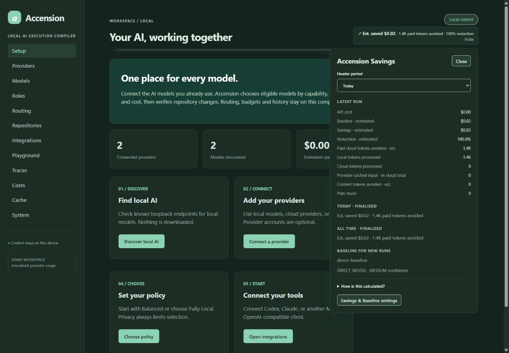
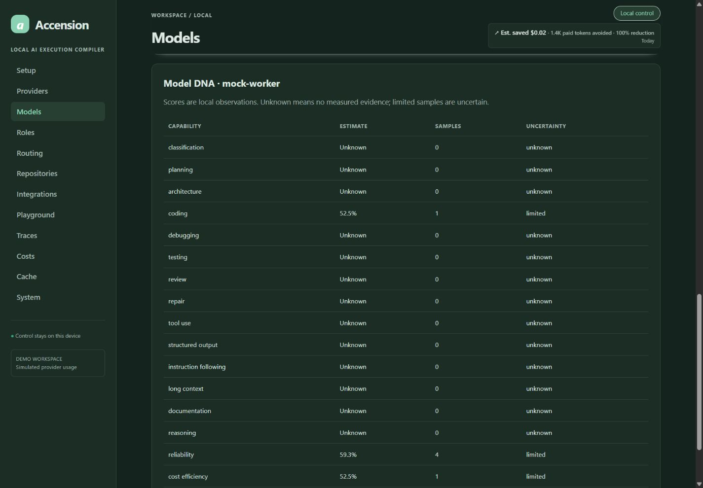
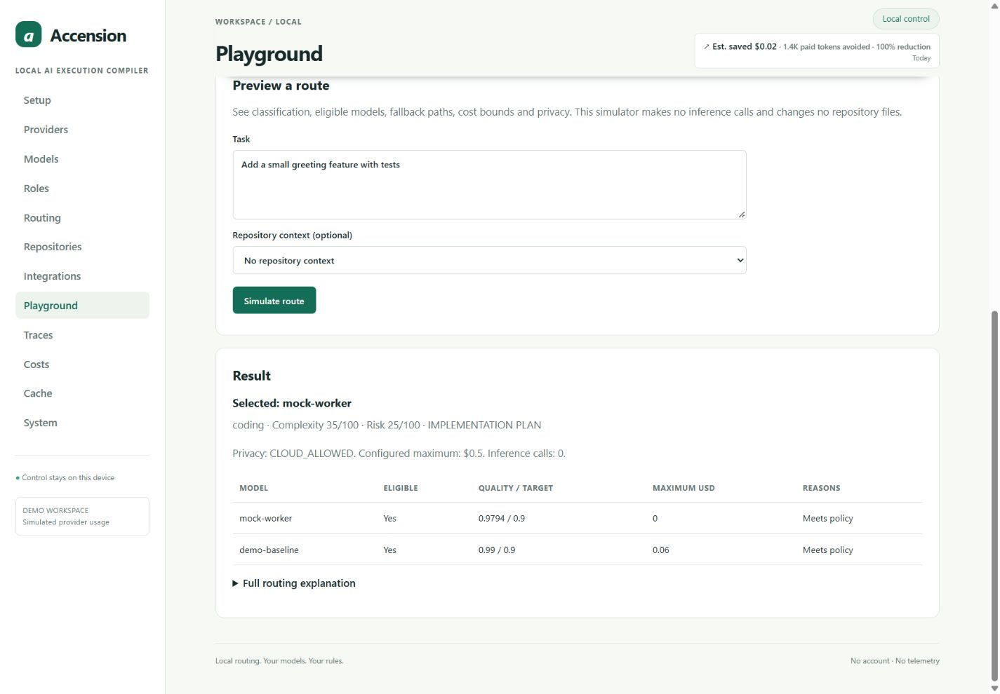
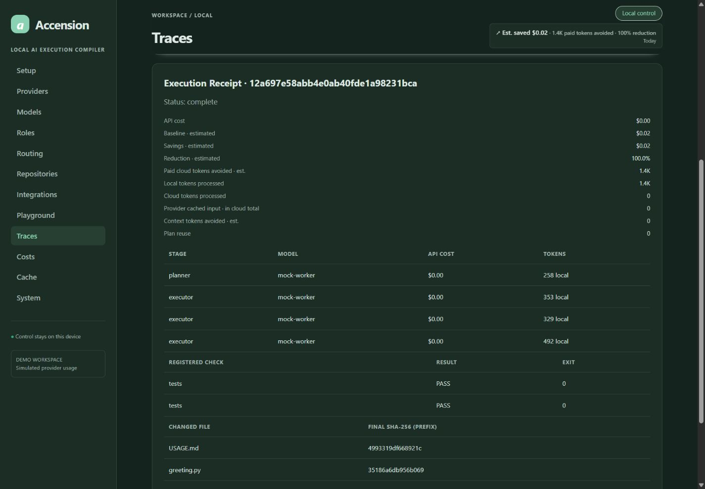
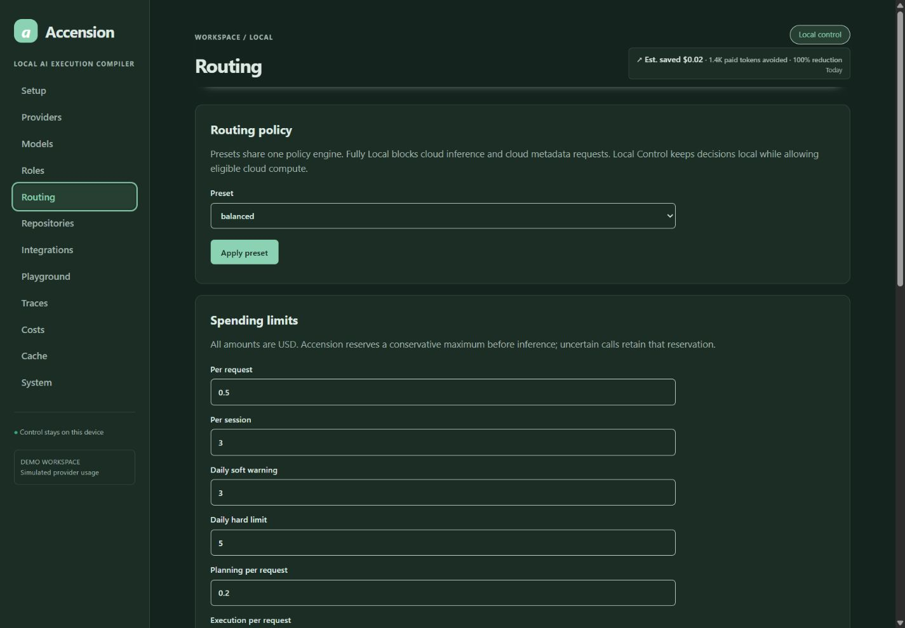
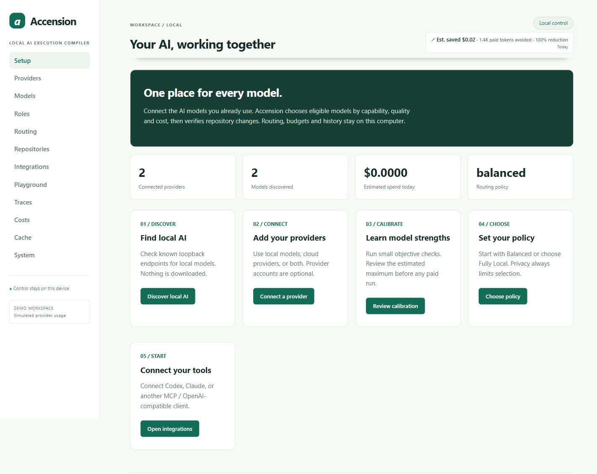
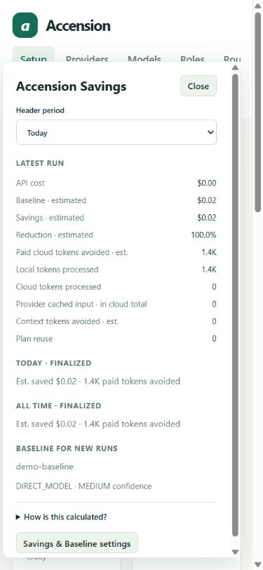

# Accension screenshot gallery

Actual browser captures from an isolated **DEMO WORKSPACE** with deterministic mock providers, captured on 2026-10-04. No production credentials, private source or personal endpoints appear. No images were generated or retouched.

The greeting fixture performed real local file edits and registered tests. Its 1,432 mock tokens and $0.018970 estimated baseline illustrate accounting at configured demo prices; they are not a benchmark or a claim of real billed savings. Model DNA shows limited/unknown evidence intentionally.

## Overview

## Live savings breakdown

## Model evidence

## Routing explanation

## Execution receipt

## Additional views

When sharing on GitHub or LinkedIn, retain the demo context and describe savings as estimates. Browser verification additionally covered negative savings, unknown pricing, period changes, Escape dismissal and cross-process live updates. Those fault-injection fixtures are separate from this showcase workspace.
